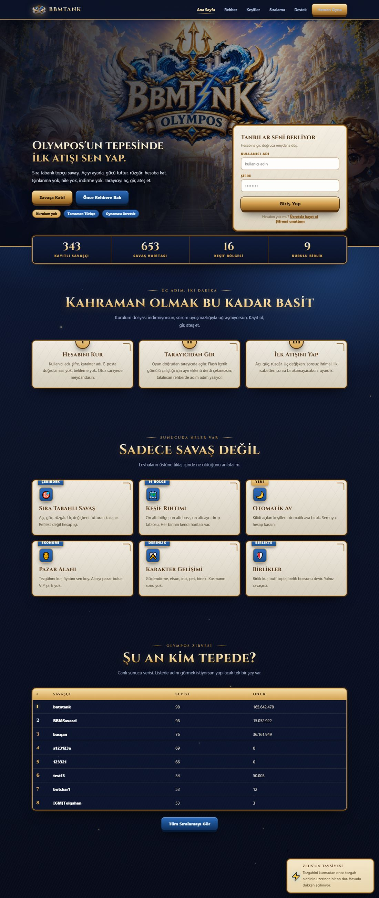
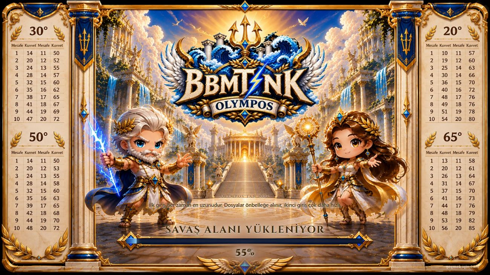
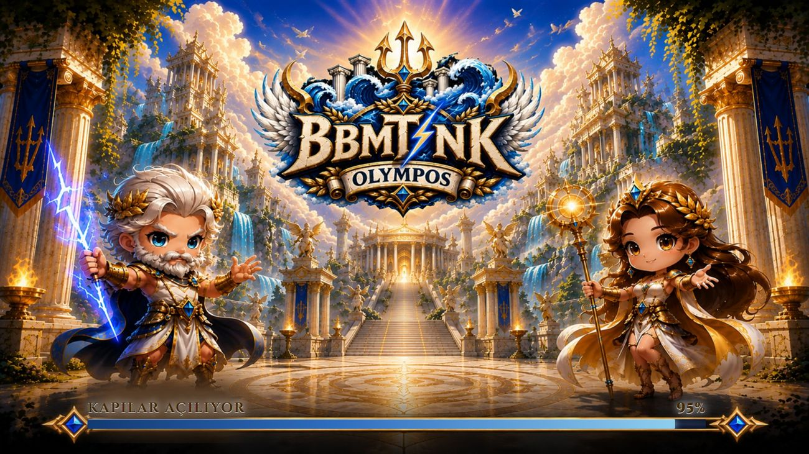
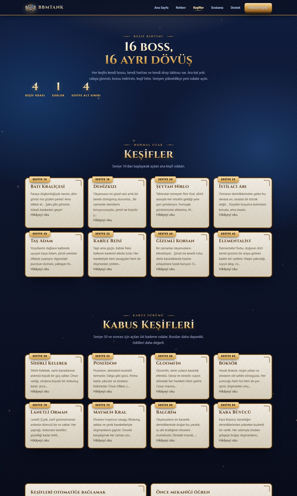
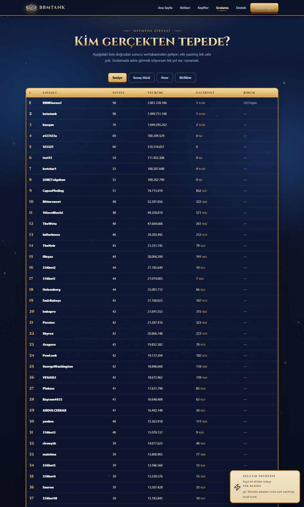
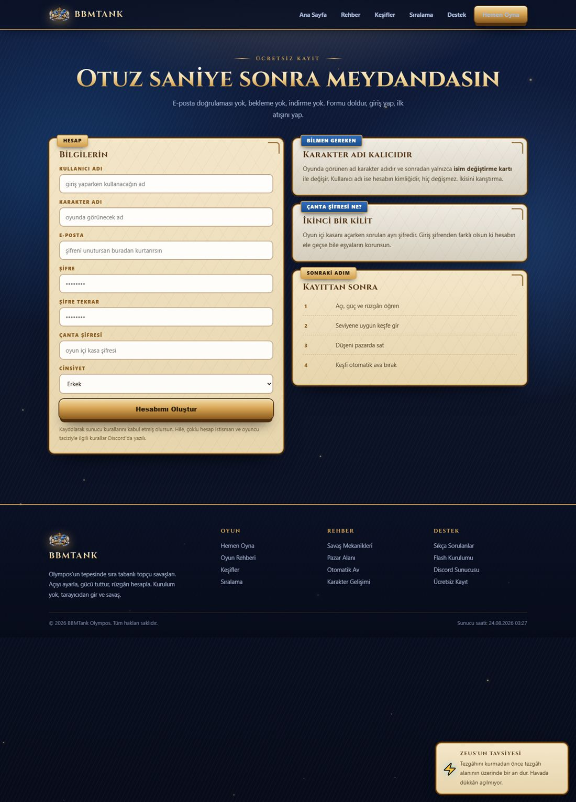

# BBMTank Olympos — Web Sitesi

Sıra tabanlı topçu oyunu **BBMTank**'ın oyuncu sitesi. Tek bir tasarım dili üzerine
kurulu, PHP + tek CSS + tek JS; derleme adımı, paket yöneticisi veya çerçeve yok.



---

## Ne var içinde?

| Sayfa | Ne yapar |
|---|---|
| `Anasayfa.php` | Hero, giriş formu, canlı sunucu sayaçları, sistem kartları, ilk 8 sıralama, haberler |
| `index.php` | Giriş yapmış oyuncunun paneli: savaş gücü, cüzdan, karne, kısayollar, **OYNA** |
| `rehber.php` | Oynanış rehberi: açı / güç / rüzgâr, keşifler, pazar, otomatik av, karakter gelişimi |
| `kesifler.php` | 16 keşif bölgesi, seviye eşikleri ve boss hikâyeleri |
| `siralama.php` | Canlı liderlik tablosu — seviye / savaş gücü / onur / birlik sekmeleri |
| `destek.php` | Sıkça sorulanlar (akordeon) |
| `register.php` | Kayıt formu, sunucu tarafı doğrulama ile |
| `getnewpass.php` | E-posta ile şifre sıfırlama |
| `play.php` | Oyunu açar; üstüne tam ekran **açılış ekranı** biner |

Ortak kabuk `parts/ust.php` + `parts/alt.php`; her sayfa sadece kendi içeriğini yazar.

---

## Tasarım sistemi

Palet **tahminle değil**, kaynak görsellerden piksel sayılarak çıkarıldı:

| Rol | Kod |
|---|---|
| Altın | `#d4a251` |
| Altın ışık | `#f4dca6` |
| Mavi | `#1a4d8c` |
| Şimşek | `#90ceee` |
| Krem | `#f0d0b0` |
| Gece | `#070c1a` |

Bileşenler (`assets/bbm.css`):

* `.levha` — mermer levha; altın çift çerçeve, damar dokusu, üstünde `.flama` şeridi
* `.btn` — altın kabartma düğme; basınca gerçekten çöker, üstünden parlama geçer
* `.baslik` — tapınak alınlığı başlık (Cinzel)
* `.oly-hero` — tam kanamalı sahne, fare ve kaydırmayla paralaks
* `.oly-load` / `.oyun-acilis` — yükleme ekranları
* `.sss` — akordeon, `.tablo` — sıralama tablosu, `.sekmeler` — sekme çubuğu

`assets/bbm.js` içindeki etkileşimler: kademeli giriş animasyonu, mermer tablet modal,
kartlarda 3B eğilme, sayaç animasyonu, uçuşan altın zerreler, hero paralaksı,
şimşek imleci izi ve köşede espri yapan **Zeus'un Tavsiyesi** balonu.

---

## Yükleme ekranları

Tasarım görsellerinin içinde zaten çizili bir altın çubuk var. Ekran görüntüsü koyup
üstüne ayrı bir çubuk çizmek yerine, görseldeki çubuğun **tam içine** canlı dolgu
bindiriliyor:

1. Görseldeki pişmiş `YÜKLENİYOR` / `100%` yazıları temizlenir, çubuğun içi boş raya çevrilir.
2. Çubuğun koordinatları piksel taramasıyla ölçülür ve yüzdeye çevrilir.
3. Tuval `16:9` oranına kilitlenir (`--h: min(56.25vw, 100vh)`), böylece aynı yüzdeler
   her ekran oranında doğru yere denk gelir.

Oyun açılışında ilerleme uydurma değil — Flash nesnesinin `PercentLoaded()` değerinden
okunur; metot yoksa yumuşak bir rampa ile `%92`de bekler ve hazır olunca kapanır.



Site içi geçişlerde de aynı yöntemle üç ayrı yükleme sahnesinden biri açılır:



---

## Kurulum

Gereken: **IIS veya Apache + PHP** ve `sqlsrv` eklentisi, bir de **SQL Server**
(oyun veritabanları `BBM_Membership` ve `BBM_Tank`).

```bash
# 1) dosyaları site köküne koy
# 2) gizli yapılandırmayı oluştur — tercihen site klasörünün BİR ÜSTÜNE
cp gizli.ornek.php ../gizli.php
# 3) ../gizli.php içindeki SQL ve (istersen) SMTP bilgilerini doldur
```

`gizli_yukle.php` dosyayı sırayla iki yerde arar:

1. `../gizli.php` — **önerilen.** Web kökünün dışında kaldığı için, PHP işleyicisi bir
   şekilde devre dışı kalsa bile dosya tarayıcıya düz metin olarak servis edilemez.
2. `./gizli.php` — basit kurulum; aynı klasörde de çalışır.

`gizli.php` `.gitignore` içindedir ve **asla** depoya girmez; yoksa sayfa kibarca
"yapılandırma eksik" der. İçinde SQL bilgileri, SMTP hesabı, yönetici paneli şifresi ve
`clientlog.php` erişim anahtarı bulunur.

Sayfalar veriyi doğrudan veritabanından okur; sıralama, oyuncu sayısı ve harita sayısı
gibi rakamların hiçbiri elle yazılmamıştır.

---

## Ekran görüntüleri

| | |
|---|---|
|  |  |
|  | |

---

## Güvenlik

Site devralınan bir kod tabanından geliyor; temizlik sırasında kapatılanlar:

* `Anasayfa.php`'de sayfada karşılığı olmayan ama **dışarıdan POST ile çalıştırılabilen**
  bir kayıt bloğu vardı. Captcha `$_SESSION['dnss_code']` ile karşılaştırılıyordu ve bu
  değer hiçbir yerde atanmıyordu; boş captcha ile `'' != null` FALSE döndüğü için kontrol
  geçiliyor, blok hesabı `Grade=17 / GP=264058` ile açıyordu.
* Obfuscate edilmiş bir yardımcı dosya (`eval(base64_decode(...))`, `chr()` ile kurulan
  fonksiyon adları, uzaktan içerik çekme) web kökünden çıkarıldı.
* Kimlik doğrulaması olmayan bir hediye kodu üreticisi ve artık hiçbir arayüzü olmayan
  webshop uçları (`ajax.php`, `module.php`, `class2/`, `class4/`, `module/`, `pay/`)
  web kökünden çıkarıldı — hepsi zaten kırıktı.
* Bütün sorgular parametreli (`qp`/`qp1`); `addslashes`/karakter silen "escape"
  fonksiyonlarına dayanılmıyor.
* Oturum: girişte `session_regenerate_id`, çerezi de temizleyen çıkış, çıkışta jeton,
  giriş/kayıt/şifre kurtarma formlarında CSRF.
* Şifre sıfırlama bağlantısı 1 saat geçerli ve tek kullanımlık; kod ve yeni şifre
  `random_bytes`/`random_int` ile üretiliyor.
* Yönetici paneli IP başına 5 denemede 15 dakika kilitleniyor.
* `clientlog.php` yalnızca yerel/özel ağdan ya da anahtarla erişilebiliyor.

## Notlar

* Bu depo yalnızca **web sitesi** katmanını içerir; oyun sunucusu, yönetim paneli ve
  istemci dosyaları burada değildir.
* `assets/olympos/` içindeki görseller bu sunucu için üretilmiştir.
* Depoya hiçbir kimlik bilgisi, bağlantı dizesi veya API anahtarı eklenmemiştir.
